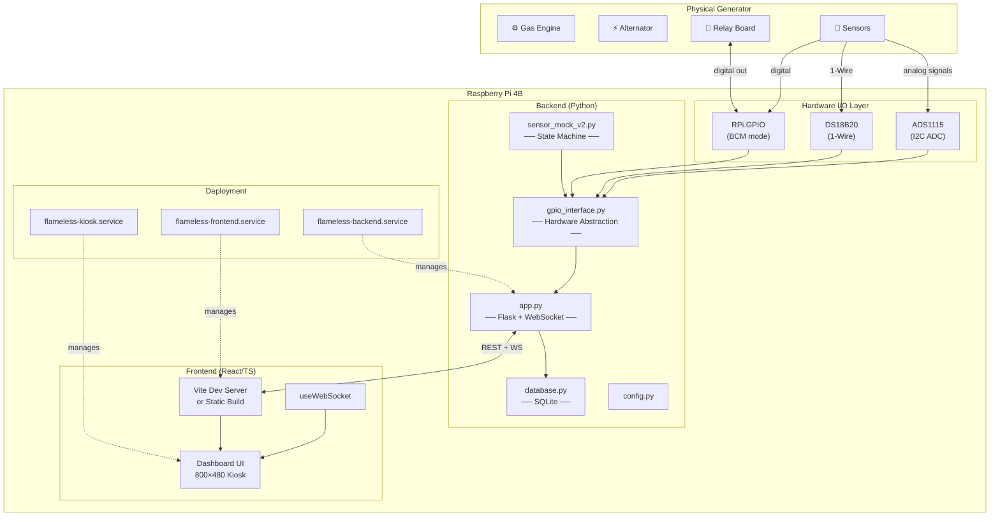
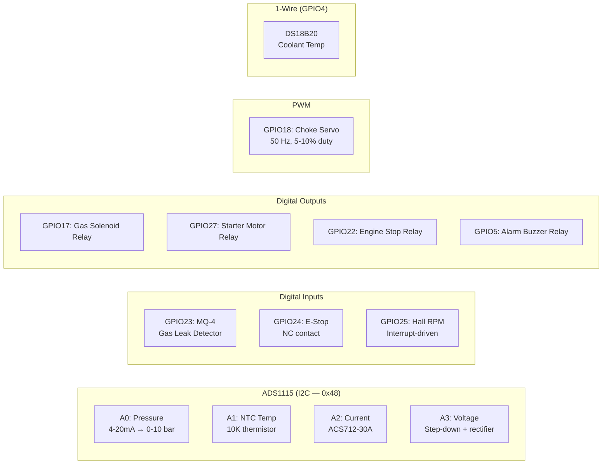
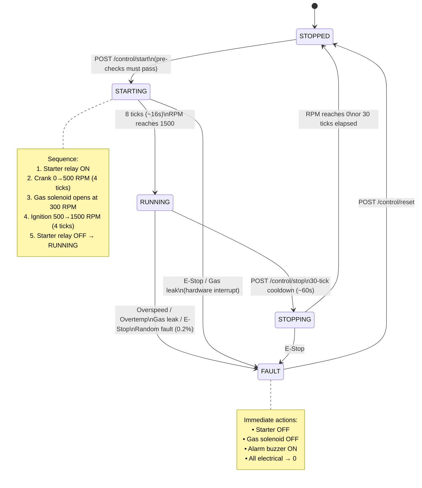
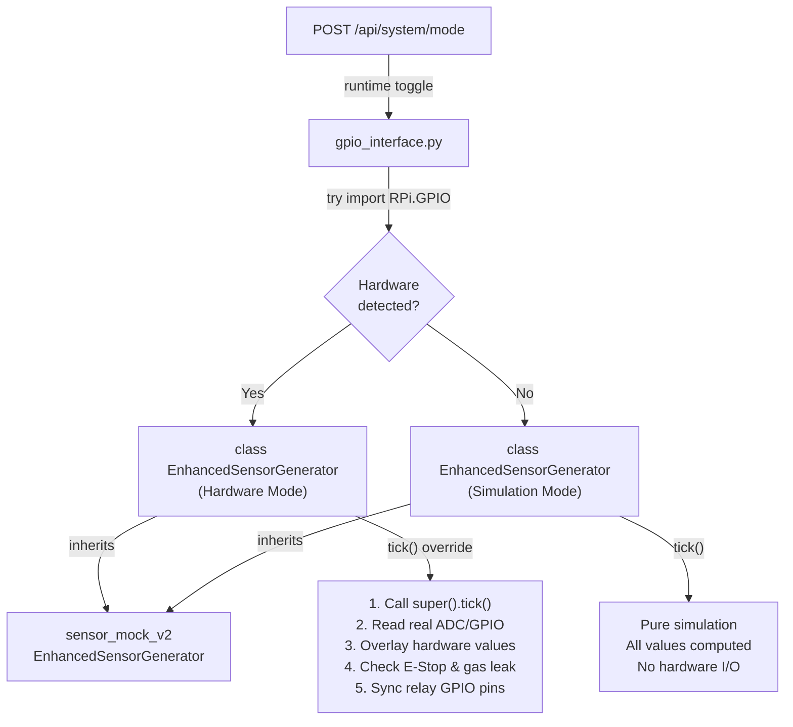
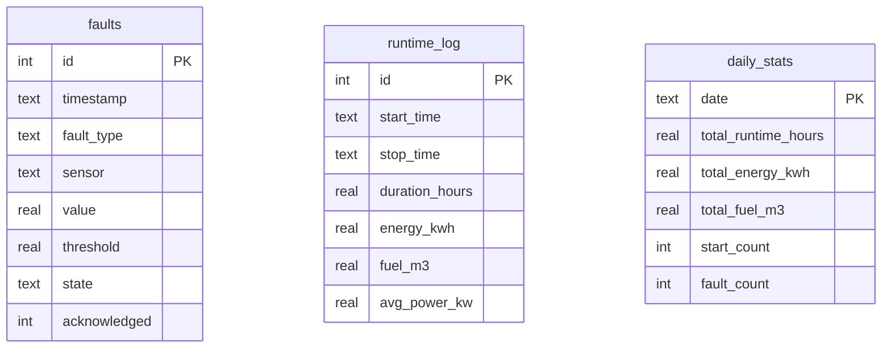
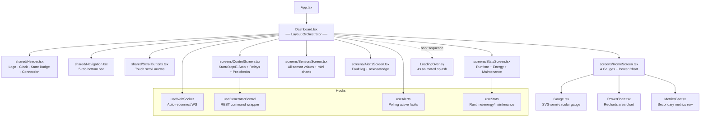
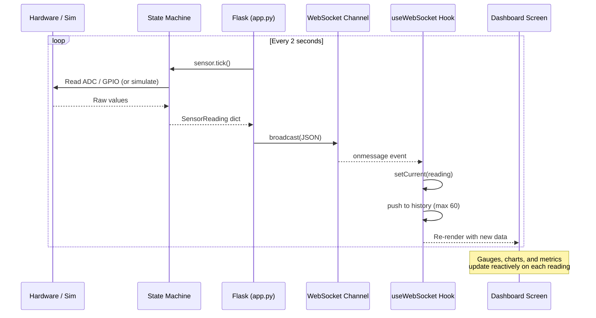
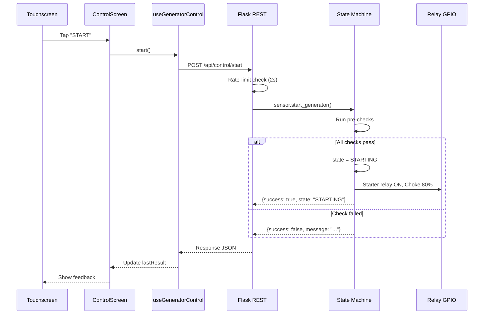
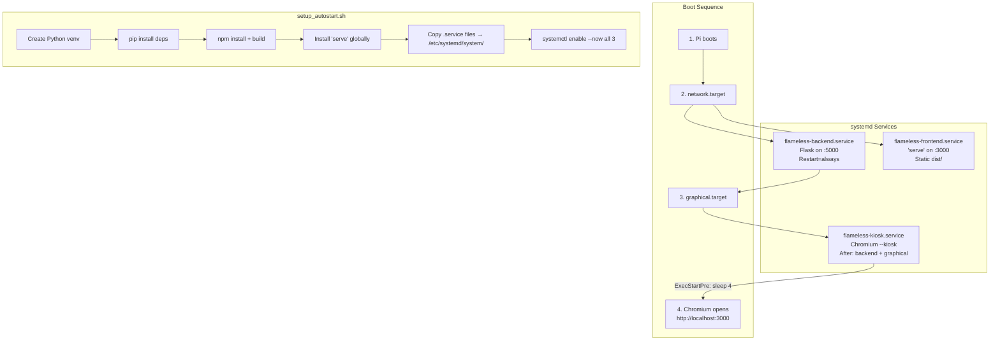

# FLAMELESS Generator Monitoring Dashboard — System Architecture

> A real-time IoT monitoring and control system for a flare-gas-to-electricity generator, running on a Raspberry Pi 4B with a 7″ touchscreen (800×480).

---

## 1. High-Level System Topology



---

## 2. Layer-by-Layer Breakdown

### 2.1 Physical / Hardware Layer

The system interfaces with real generator hardware through the Pi's GPIO header:



| Sensor/Actuator | Interface | Pin/Channel | Calibration |
|---|---|---|---|
| Gas Pressure | ADS1115 A0 | I2C | 4-20mA, 100Ω shunt → 0.40–2.00V = 0–10 bar |
| Engine Temp (NTC) | ADS1115 A1 | I2C | 10KΩ NTC, β=3950, Steinhart–Hart model |
| AC Current | ADS1115 A2 | I2C | ACS712-30A: 66mV/A, midpoint 2.5V |
| AC Voltage | ADS1115 A3 | I2C | Step-down transformer × 80 scale factor |
| Coolant Temp | DS18B20 | 1-Wire (GPIO4) | Direct °C reading (preferred over NTC) |
| RPM | Hall-effect | GPIO25 | Rising-edge interrupt, 1 pulse/rev |
| Gas Leak | MQ-4 | GPIO23 | Digital: HIGH = leak detected |
| E-Stop | NC switch | GPIO24 | Pull-up: HIGH = clear, LOW = pressed |
| Gas Solenoid | Relay | GPIO17 | HIGH = energised (valve open) |
| Starter Motor | Relay | GPIO27 | HIGH = cranking |
| Engine Stop | Relay | GPIO22 | HIGH = shutdown solenoid engaged |
| Alarm Buzzer | Relay | GPIO5 | HIGH = alarm sounding |
| Choke Servo | PWM | GPIO18 | 50Hz servo: 5% = closed, 10% = fully open |

> [!IMPORTANT]
> **Auto-detection**: On boot, [gpio_interface.py](file:///c:/Users/HP/.gemini/antigravity/scratch/flameless-dashboard/backend/gpio_interface.py) attempts to import `RPi.GPIO`, `adafruit_ads1x15`, and `w1thermsensor`. If **any** import fails, the entire system falls back gracefully to **simulation mode** — no code changes needed.

---

### 2.2 Backend — Python (Flask)

The backend is a **single Flask process** that runs the sensor loop, state machine, REST API, and WebSocket broadcaster on port `5000`.

#### File Responsibilities

| File | Purpose |
|---|---|
| [app.py](file:///c:/Users/HP/.gemini/antigravity/scratch/flameless-dashboard/backend/app.py) | Flask server, REST endpoints, WebSocket channels, sensor loop thread, rate limiting |
| [gpio_interface.py](file:///c:/Users/HP/.gemini/antigravity/scratch/flameless-dashboard/backend/gpio_interface.py) | Hardware abstraction layer — auto-detects real GPIO or falls back to simulation |
| [sensor_mock_v2.py](file:///c:/Users/HP/.gemini/antigravity/scratch/flameless-dashboard/backend/sensor_mock_v2.py) | Full state-machine simulator with realistic correlated sensor values |
| [sensor_mock.py](file:///c:/Users/HP/.gemini/antigravity/scratch/flameless-dashboard/backend/sensor_mock.py) | Legacy v1 simulator (simple running-only, no state machine) |
| [database.py](file:///c:/Users/HP/.gemini/antigravity/scratch/flameless-dashboard/backend/database.py) | SQLite persistence: fault log, runtime sessions, daily stats, Pi health, CSV export |
| [config.py](file:///c:/Users/HP/.gemini/antigravity/scratch/flameless-dashboard/backend/config.py) | Environment-driven configuration (host, port, interval, CORS) |

#### Sensor Loop (core runtime)

```python
# Runs every 2 seconds in a daemon thread
while True:
    reading = sensor.tick()      # Advance state machine + read sensors
    _broadcast(ws_sensors, reading)  # Push to all connected WebSocket clients
    
    if state_changed:
        _broadcast(ws_state, state_event)
        track_run_session(db)    # Start/end runtime records in SQLite
    
    if fault_detected:
        db.log_fault(...)
        _broadcast(ws_alerts, alert_event)
    
    time.sleep(2.0)
```

#### REST API Surface

| Method | Endpoint | Description |
|---|---|---|
| `GET` | `/api/sensors/current` | Latest sensor reading |
| `GET` | `/api/sensors/history` | Last 150 readings (in-memory ring buffer) |
| `GET` | `/api/system/status` | Current state, alert, uptime, CO₂ saved |
| `POST` | `/api/control/start` | Start generator (with pre-checks) |
| `POST` | `/api/control/stop` | Graceful shutdown (60s cooldown) |
| `POST` | `/api/control/estop` | Emergency stop (bypasses rate limiter) |
| `POST` | `/api/control/reset` | Clear fault state |
| `POST` | `/api/control/relay/<name>` | Toggle individual relay |
| `GET` | `/api/control/status` | State + pre-check results |
| `GET` | `/api/alerts/active` | Unacknowledged faults |
| `GET` | `/api/alerts/history` | Fault history (default 50) |
| `POST` | `/api/alerts/acknowledge` | Acknowledge a fault by ID |
| `GET` | `/api/diagnostics/health` | Pi CPU/RAM/disk/temp/uptime |
| `GET` | `/api/stats/runtime` | Total hours, starts, energy |
| `GET` | `/api/stats/energy` | Daily energy (30 days) |
| `GET` | `/api/stats/efficiency` | Fuel consumption, cost/kWh |
| `GET` | `/api/stats/maintenance` | Maintenance schedule |
| `GET` | `/api/export/sensors/csv` | Download sensor history as CSV |
| `GET` | `/api/export/faults/csv` | Download fault log as CSV |
| `GET`/`POST` | `/api/system/mode` | Get/switch simulation ↔ hardware mode |
| `POST` | `/api/system/exit-kiosk` | Kill Chromium kiosk process |
| `GET` | `/health` | Health check |
| `GET` | `/*` | Serve React production build (catch-all SPA) |

#### WebSocket Channels

| Endpoint | Purpose | Push Interval |
|---|---|---|
| `ws://host:5000/ws/sensors` | Real-time sensor readings | Every 2s |
| `ws://host:5000/ws/alerts` | Fault/alert notifications | On event |
| `ws://host:5000/ws/state` | State transition events | On change |

> [!NOTE]
> All three WS channels use a shared **broadcast helper** with automatic dead-client cleanup. Clients that fail to receive are silently dropped.

#### Rate Limiting

All control commands (except E-Stop) are rate-limited to **1 command per 2 seconds** to prevent accidental rapid-fire toggles on the touchscreen.

---

### 2.3 Generator State Machine

The core of the system is a **5-state finite state machine** in [sensor_mock_v2.py](file:///c:/Users/HP/.gemini/antigravity/scratch/flameless-dashboard/backend/sensor_mock_v2.py):



#### Pre-Start Checks

Before transitioning `STOPPED → STARTING`, all five checks must pass:

| Check | Condition |
|---|---|
| E-Stop Clear | GPIO24 HIGH (NC contact closed) |
| No Gas Leak | GPIO23 LOW (MQ-4 not triggered) |
| Engine Cool (<50°C) | Temperature below 50°C |
| Gas Pressure Available | Pressure sensor reading valid |
| State is STOPPED | Not already running or faulted |

#### Hardware ↔ Simulation Dual Mode



> [!TIP]
> The `_force_simulation` flag can be toggled at runtime via `POST /api/system/mode {"simulation": true/false}` — useful for testing the UI with simulated data even when hardware is connected.

---

### 2.4 Database Layer (SQLite)

Located at [data/flameless.db](file:///c:/Users/HP/.gemini/antigravity/scratch/flameless-dashboard/data/flameless.db), the database tracks three tables:



**Lifecycle**: A new `runtime_log` row is created when state transitions `STARTING → RUNNING`. It is closed (with duration, energy, fuel) when state leaves `RUNNING` (→ `STOPPING`, `FAULT`, or `STOPPED`).

---

### 2.5 Frontend — React + TypeScript (Vite)

The frontend is a **single-page application** optimized for a 800×480 touchscreen kiosk display.

#### Tech Stack

| Tech | Purpose |
|---|---|
| React 18 | UI framework |
| TypeScript | Type safety |
| Vite | Build tool + HMR dev server |
| Recharts | Power/sensor area charts |
| Vanilla CSS (inline) | No utility framework — all styles in JSX |

#### Component Architecture



#### Screen Navigation

| Screen | Tab | Content |
|---|---|---|
| **Home** | 🏠 | 4 SVG gauges (Power, Temp, RPM, Pressure) + live power chart + metrics bar |
| **Control** | ⚙️ | Start/Stop/E-Stop buttons, relay toggles, pre-check panel, cooldown timer |
| **Sensors** | 📊 | Full sensor readings table + mini sparkline charts per parameter |
| **Alerts** | ⚠️ | Active + historical fault list with acknowledge button, badge count |
| **Stats** | 📈 | Runtime stats, efficiency metrics, energy history, maintenance schedule |

#### Data Flow: Sensor → Screen



#### Control Flow: User → Generator



---

### 2.6 Deployment Architecture



#### Service Details

| Service | Port | Command | Restart Policy |
|---|---|---|---|
| `flameless-backend` | 5000 | `python3 app.py` | Always (5s delay) |
| `flameless-frontend` | 3000 | `serve -s dist -l 3000` | Always |
| `flameless-kiosk` | — | `chromium --kiosk --noerrdialogs http://localhost:3000` | On-failure (10s delay) |

> [!NOTE]
> In **production**, the Flask backend also serves the React build via a catch-all route (`/*` → `index.html`), so port 3000 is optional. In **development**, Vite runs on :3000 with HMR and proxies API calls to :5000.

---

## 3. Key Design Decisions

| Decision | Rationale |
|---|---|
| **Dual-mode hardware abstraction** | Same codebase runs on dev laptop (simulation) and Pi (real GPIO) — zero config changes |
| **WebSocket for sensor data** | 2-second push interval is far more efficient than polling; supports multiple simultaneous viewers |
| **In-memory history + SQLite persistence** | Ring buffer (deque) for fast real-time chart data; SQLite for long-term fault/runtime records |
| **State machine in Python** | All safety logic (pre-checks, fault detection, relay sequencing) lives server-side — UI is display-only for safety |
| **Rate-limited control API** | Prevents accidental double-taps on touchscreen from sending duplicate commands |
| **E-Stop bypasses rate limiter** | Safety-critical — must never be delayed |
| **Kiosk mode with exit API** | Full-screen Chromium for operator simplicity; `POST /api/system/exit-kiosk` allows admin escape |
| **Touch-optimized 800×480 layout** | All UI elements sized for finger interaction; scroll buttons for long content |

---

## 4. Complete File Map

```
flameless-dashboard/
├── backend/
│   ├── app.py                  ← Flask server + WS broadcaster + sensor loop
│   ├── gpio_interface.py       ← Hardware abstraction (auto-detect GPIO/sim)
│   ├── sensor_mock_v2.py       ← State machine + simulated sensor generator
│   ├── sensor_mock.py          ← Legacy v1 simulator (simple RUNNING-only)
│   ├── database.py             ← SQLite: faults, runtime_log, daily_stats
│   ├── config.py               ← Env-driven config (host, port, interval)
│   └── requirements.txt        ← flask, flask-cors, flask-sock
│
├── frontend/
│   ├── src/
│   │   ├── App.tsx             ← Root component → Dashboard
│   │   ├── main.tsx            ← React entry point
│   │   ├── components/
│   │   │   ├── Dashboard.tsx   ← Layout orchestrator + boot splash
│   │   │   ├── Gauge.tsx       ← SVG semi-circular gauge widget
│   │   │   ├── PowerChart.tsx  ← Recharts live area chart
│   │   │   ├── MetricsBar.tsx  ← Secondary metrics row
│   │   │   ├── Header.tsx      ← (legacy) header component
│   │   │   ├── StatusBar.tsx   ← (legacy) footer status
│   │   │   ├── shared/
│   │   │   │   ├── Header.tsx         ← Logo + clock + state badge
│   │   │   │   ├── Navigation.tsx     ← 5-tab bottom nav bar
│   │   │   │   ├── ScrollButtons.tsx  ← Touch scroll arrows
│   │   │   │   └── StatusIndicator.tsx ← Colored state dot
│   │   │   └── screens/
│   │   │       ├── HomeScreen.tsx     ← Gauges + chart + metrics
│   │   │       ├── ControlScreen.tsx  ← Start/Stop/E-Stop + relays
│   │   │       ├── SensorsScreen.tsx  ← Full sensor readout
│   │   │       ├── AlertsScreen.tsx   ← Fault log + acknowledge
│   │   │       └── StatsScreen.tsx    ← Runtime/energy/maintenance
│   │   ├── hooks/
│   │   │   ├── useWebSocket.ts        ← Auto-reconnecting WS + history
│   │   │   ├── useGeneratorControl.ts ← REST control command wrapper
│   │   │   ├── useAlerts.ts           ← Polling active faults
│   │   │   └── useStats.ts            ← Polling runtime/energy stats
│   │   ├── services/
│   │   │   └── api.ts                 ← Centralized REST API client
│   │   ├── styles/
│   │   │   └── theme.ts              ← Color palette + gauge ranges
│   │   └── types/
│   │       ├── sensor.ts             ← SensorReading interface
│   │       ├── control.ts            ← ControlResponse type
│   │       ├── alert.ts              ← Alert type
│   │       └── stats.ts              ← Stats types
│   ├── index.html
│   ├── vite.config.ts
│   └── package.json
│
├── data/
│   └── flameless.db            ← SQLite database (auto-created)
│
├── scripts/
│   ├── setup_autostart.sh      ← One-shot Pi deployment script
│   ├── start_backend.sh        ← Backend launcher
│   ├── start_frontend.sh       ← Frontend launcher
│   └── start_kiosk.sh          ← Chromium kiosk launcher
│
├── systemd/
│   ├── flameless-backend.service   ← Flask API service unit
│   ├── flameless-frontend.service  ← Static server service unit
│   └── flameless-kiosk.service     ← Chromium kiosk service unit
│
└── README.md
```
